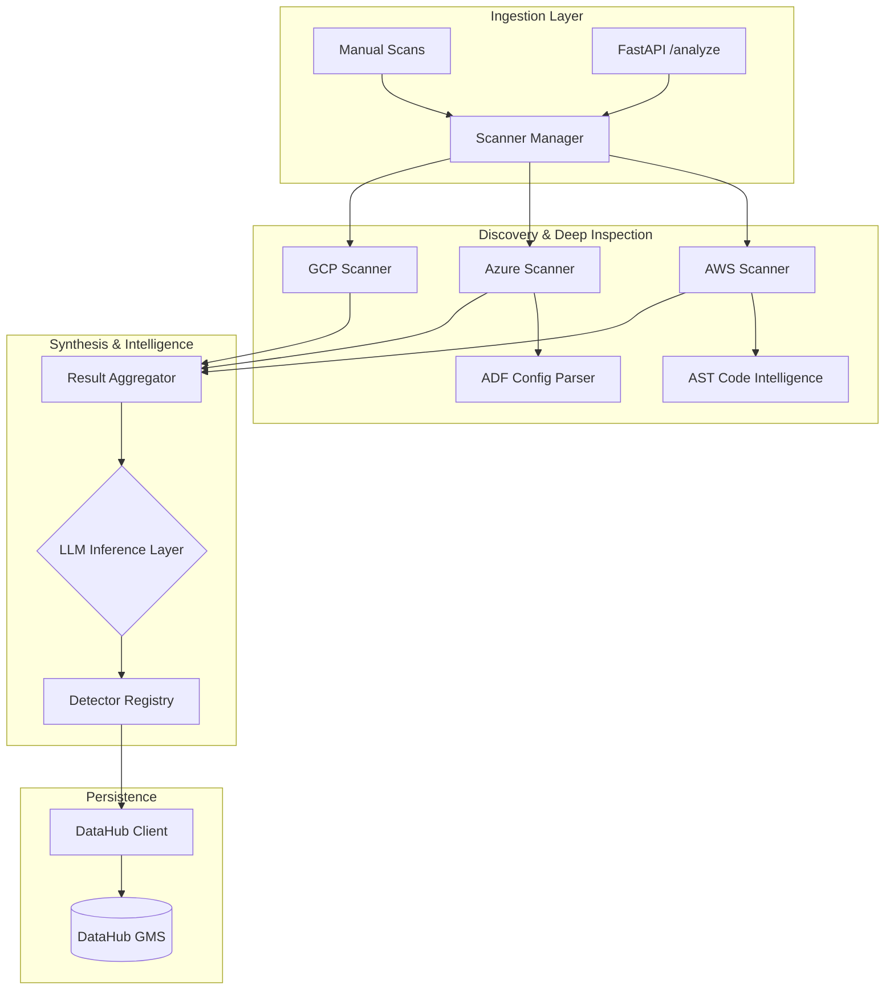

# 🏗️ Pipeline Intelligence Engine (PIE) Architecture

This document provides a detailed technical deep-dive into the internals of the Pipeline Intelligence Engine, covering its discovery mechanisms, agentic layers, and integration patterns.

---

## 🗺️ High-Level Component Map

The system is partitioned into three main layers: **Ingestion & Discovery**, **Intelligence & Analysis**, and **Metadata Persistence**.

---

## 🔍 Discovery Mechanisms

### 1. Cloud Management API Scanning
The base layer of discovery utilizes cloud-native SDKs (`boto3`, `azure-mgmt-resource`) to inventory resources.
- **AWS**: Scans S3 (Buckets), Lambda (Functions), Glue (Jobs), and API Gateway.
- **Azure**: Scans Resource Groups, Storage Accounts (ADLS), and Data Factory.
- **GCP**: Primarily utilizes simulated discovery layers (extensible via Google Cloud SDK).

### 2. Deep Inspector: AST Code Intelligence
One of the most powerful features of PIE is the `CodeIntelligenceEngine`. 
- **Mechanism**: For Compute resources (like Lambda), PIE downloads the deployment Zip, extracts Python files, and parses them into an **Abstract Syntax Tree (AST)**.
- **Extraction**: It looks for call nodes matching known SDK patterns:
    - `put_object`, `get_object` → S3 Data Links.
    - `send_message`, `publish` → Messaging Lineage.
- **Advantage**: It discovers data flows that are "hardcoded" and not declared in cloud configuration metadata.

### 3. Agentic LLM Layer (Optional)
When `LLM_ENABLED=true`, the system employs a generative agent to handle unstructured or complex JSON payloads:
- **Heuristic Refinement**: The agent validates if a detected "S3 Bucket" is actually an *Ingestion Source* or just a *Deployment Log*.
- **Classification**: Assigns confidence scores to the categorization of Frameworks, Sources, and Ingestion logic.

---

## 📊 Data Mapping & Lineage

### DataHub Integration
PIE maps discovered assets to DataHub entities using a semantic URN structure:

| Cloud Entity | DataHub Type | URN Example |
| :--- | :--- | :--- |
| S3 Bucket | `Dataset` | `urn:li:dataset:(urn:li:dataPlatform:s3,name,PROD)` |
| Snowflake Table | `Dataset` | `urn:li:dataset:(urn:li:dataPlatform:snowflake,table,PROD)` |
| Lambda | `DataProcess` | `urn:li:dataProcess:aws-lambda-name` |

### Automatic Lineage Stitching
If a Lambda function is found to read from `Bucket-A` and write to `Snowflake-Table-B`, the `DataHubClient` automatically creates a Lineage edge in DataHub, visually connecting these assets in the dashboard.

---

## 🛠️ Performance & Scalability

- **Lazy Loading**: The `ScannerManager` uses a singleton pattern with lazy imports, ensuring that the API starts quickly even if SDKs are missing.
- **Regional Exhaustion**: The AWS Scanner dynamically queries the EC2 DescribeRegions API to ensure it scans **every single active region** for the client, preventing "hidden" shadow infrastructure in unused regions.
- **Aggregated Polling**: Results are deduplicated at the manager level to prevent redundant entries in DataHub for global resources.

---

## 🚀 Use Cases in Detail

- **Shadow Infrastructure Detection**: Find pipelines created outside of Infrastructure-as-Code (Terraform/CloudFormation).
- **Data Privacy Auditing**: Identify every function that interacts with a PII-sensitive S3 bucket by analyzing the function's internal code logic.
- **Migration Impact Analysis**: Before deleting a database, use the PIE graph to see every cloud function or Glue Job that depends on it.
