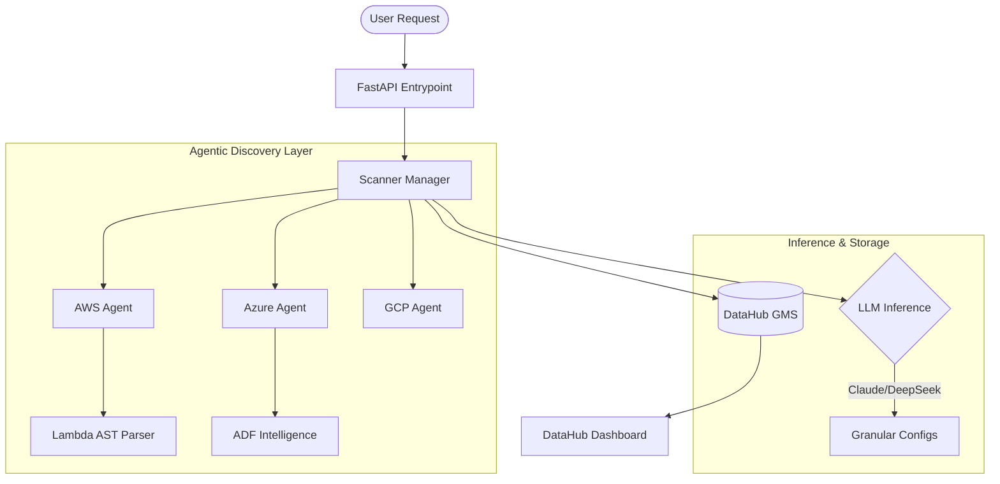

# 🛡️ Pipeline Intelligence Engine (PIE)

[](https://github.com/your-repo)
[]()
[]()

A state-of-the-art **Deep Agentic Detection Layer** designed to analyze, extract, and visualize complex data pipelines across multi-cloud environments. PIE leverages automated AST code analysis and LLM-driven inference to provide 100% provable lineage and configuration intelligence.

---

## 🚀 Key Capabilities

- **Deep Agentic Scanning**: Autonomous agents crawl AWS, Azure, and GCP to discover hidden integration patterns.
- **AST-Based Inspection**: Goes beyond static metadata by parsing Lambda and Function code to identify data sinks, sources, and formats.
- **Cross-Cloud Lineage**: Automatically stitches together flows across AWS Glue, Azure Data Factory, and Snowflake.
- **DataHub Integration**: Direct synchronization with DataHub Graph API for industrial-grade metadata management.
- **AI-Driven Confidence**: Hybrid detection using rule-based heuristics and Optional LLM (Ollama/Anthropic) verification.

---

## 📐 Architecture



---

## 🛠️ Setup & Installation

### 1. Prerequisites
- **Python 3.10+**
- **Docker** (for DataHub local quickstart)
- **DataHub**:
  ```bash
  pip install acryl-datahub
  datahub docker quickstart
  ```
  *UI: http://localhost:9002 | GMS: http://localhost:8080*

### 2. Environment Configuration
Clone the repository and prepare your environment:
```bash
git clone https://github.com/your-repo/pipeline-intelligence-engine
cd pipeline-intelligence-engine
python -m venv .venv
source .venv/bin/activate  # On Windows: .venv\Scripts\activate
pip install -r requirements.txt
```

### 3. Credentials & `.env`
Copy the template and fill in your cloud credentials:
```bash
cp .env.example .env
```

| Category | Variable | Description |
| :--- | :--- | :--- |
| **DataHub** | `DATAHUB_GMS_URL` | URL to DataHub GMS (default: http://localhost:8080) |
| **LLM** | `LLM_ENABLED` | Set to `true` to enable deep AI inference |
| **AWS** | `AWS_ACCESS_KEY_ID` | Required for Lambda/S3/Glue scanning |
| **Azure** | `AZURE_TENANT_ID` | Required for ADF/Storage scanning |
| **GCP** | `GCP_PROJECT_ID` | Required for BigQuery/GCS scanning |

---

## 🚦 Execution

### Start the Intelligence API
```bash
uvicorn api.main:app --reload --port 8000
```

### Run a Full Cloud Discovery
Execute the scanning manager manually to ingest all cloud assets into DataHub:
```bash
python scripts/test_full_scan.py
```

### Run Performance & Logic Tests
```bash
pytest tests/ -v
```

---

## 📡 API Endpoints

### `POST /analyze`
Analyzes a raw metadata payload to extract framework and ingestion logic.

**Example Payload:**
```json
{
  "metadata": { "platform": "glue", "name": "customer_etl" },
  "config": { "connections": ["s3://production-data/raw"] },
  "raw_json": { "type": "GlueJob", "dq": { "threshold": 0.99 } }
}
```

**Response:**
```json
{
  "framework": ["AWS Glue"],
  "source": ["S3"],
  "ingestion": ["Spark/Glue Jobs"],
  "confidence": { "framework": 0.98, "source": 0.95 },
  "datahub_lineage": ["urn:li:dataset:(urn:li:dataPlatform:s3,production-data/raw,PROD)"]
}
```

---

## 🧩 Extending the Engine

To add a new discovery capability, implement the `BaseDetector` in `engine/detectors/`:

```python
from engine.detectors.base import BaseDetector, DetectionResult

class MyNewDetector(BaseDetector):
    name = "custom_detector"

    def detect(self, payload) -> DetectionResult:
        # Custom logic here
        return DetectionResult(results=["CustomResult"], confidence=0.9)
```

---

## 📄 License
This project is licensed under the Apache 2.0 License. See [LICENSE](LICENSE) for details.
"# pipeline-intelligence-engine" 
